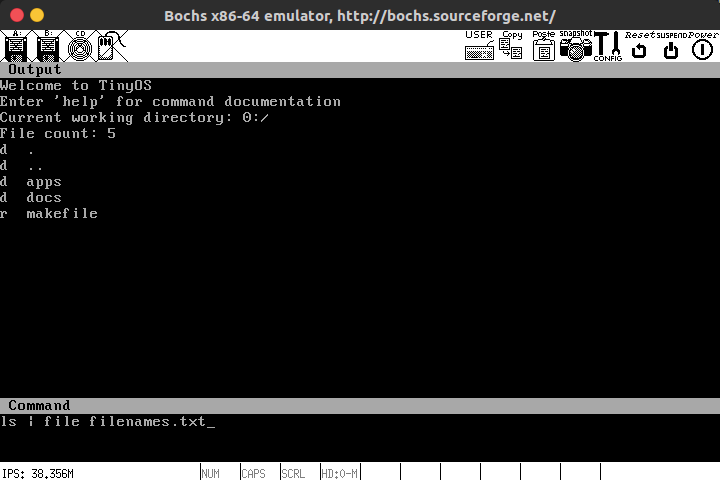
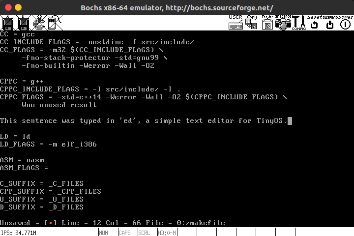

# TinyOS

学习用小型操作系统，运行在x86（32位）单核计算机上。Bootloader部分参考了《操作系统真象还原》一书，其他的部分就放飞自我、甚至可以说是非Unix-like了。

---

## 特性

- [x] 分页内存管理
- [x] 抢占式线程调度
- [x] 信号量
- [x] 进程资源管理
- [x] 系统调用框架
- [x] 键盘驱动程序
- [x] 进程间消息传递
- [x] 文件系统
- [x] 用户界面
- [x] 管道通信
- [x] cat等基本应用程序，以及一个简易文本编辑器

## 编译

bochs的编译运行依赖于：

> bochs 2.65+, gnu make, gcc, g++, ld, nasm, dd, bximage（通常随bochs一起安装）

要使用bochs运行该系统，可执行以下步骤：

1. 跟据bochs所附带的显示插件，修改`bochsrc.txt`中的`display_library`项
2. 初次运行前，运行`make fs`初始化磁盘映像
3. 运行`make run`以构建项目并启动虚拟机

由于磁盘映像创建工具bximage的命令参数格式曾发生变动，因此若无法正确初始化磁盘映像文件，可尝试运行`bash setup.sh`以解决问题。

## 交互

系统默认交互界面分为Output区域和Command区域，前者用于显示输出，后者用于输入命令。系统已经提供的命令包括：

1. cd path              : 修改当前工作路径
2. clear                : 清空Output区域
3. exec path name ...   : 从一个elf文件创建一个进程
4. exit                 : 退出系统
5. fg [pid]             : 将一个后台进程切换到前台
6. kill p1 [p2] ...     : 销毁一些进程
7. ps                   : 查看后台运行的进程列表

此外，还有以下应用程序可供使用：

1. cat                  : 查看文件内容
2. cp                   : 复制文件
3. ed                   : 一个简单的文本编辑器
4. file                 : 将管线输出保存到文件
5. help                 : 查看命令/应用程序的帮助信息
6. less                 : 以只读方式浏览文件内容
7. ls                   : 查看当前工作路径下的文件列表
8. pwd                  : 查看当前工作路径

输入`help command/application`可以查看命令或应用程序的用法。
